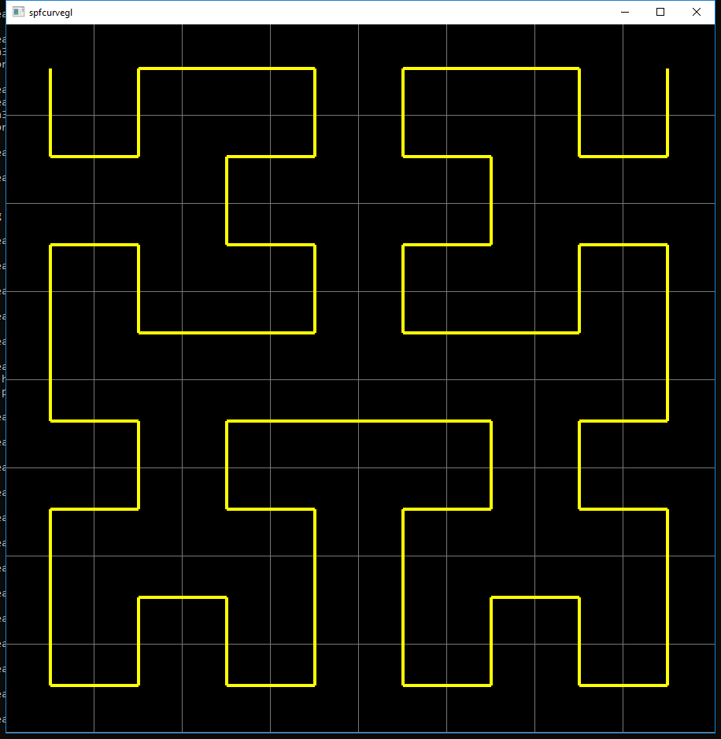
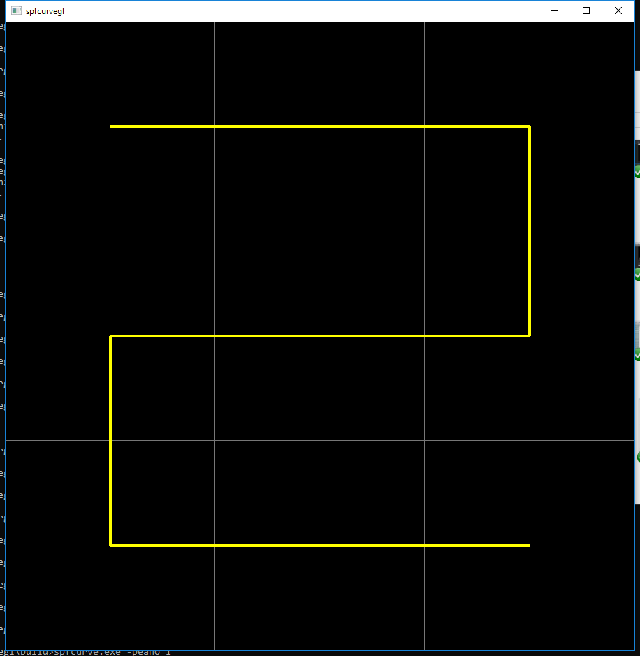
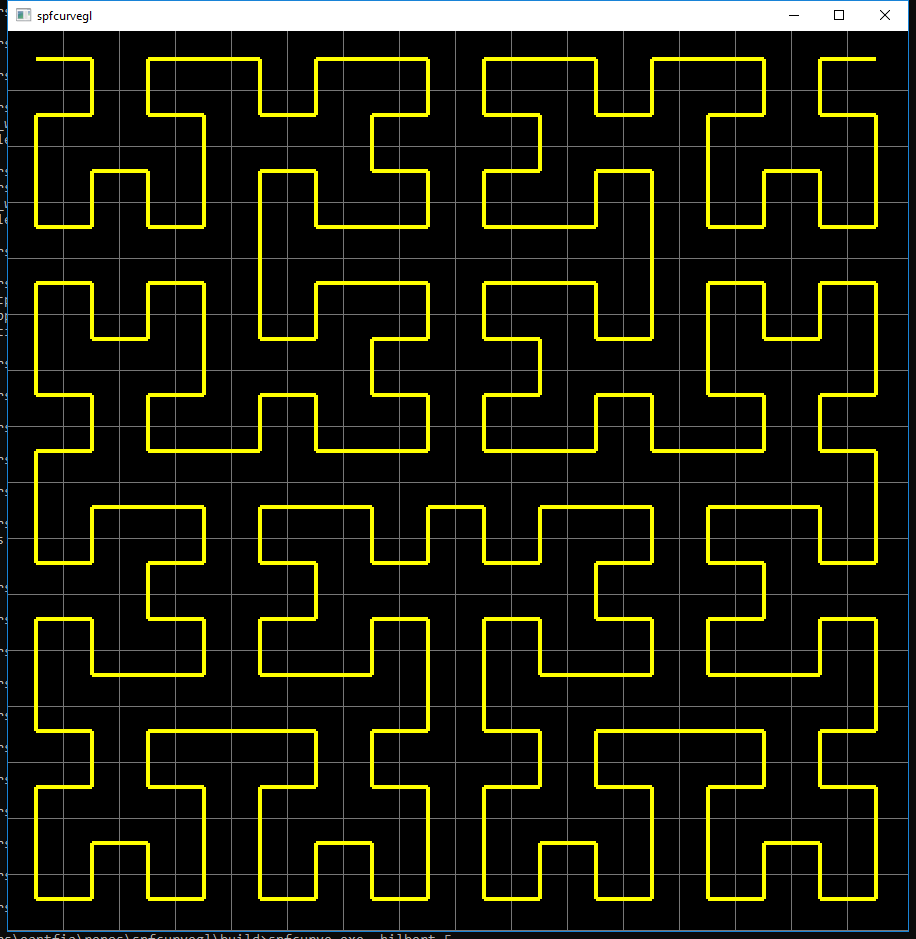
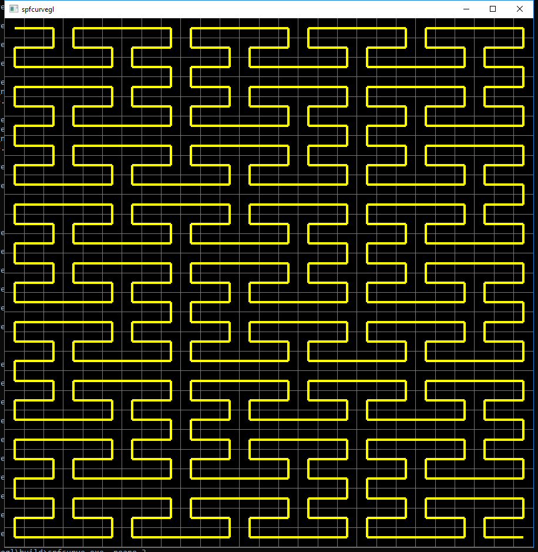

SPFCURVEGL
===

### Description ###
An GLFW/OpenGL based implementation of the space-filling curves: hilbert and peano.

### Building ###
I provide a build_win32.bat batch file that can be used for building the program
in Microsof Windows from the command prompt. The build will be placed under build/.
You will need to download the Visual Studio compiler (https://visualstudio.microsoft.com/)
and setup your shell for compilation. More instructions can be found in build_win32.bat.  
Alternatively, you can build from within Visual Studio, but you will need to provide
the arguments to be able to change the curve at your convenience (or change the source).
A .sln file is part of the repository (VS 2017).

### Running ###
Once built, you can generate curves like follows: 
spfcurve.exe -hilbert level  
spfcurve.exe -peano level  
where level >= 1 is the order of the curve to be generated.  
**Warning!** Beware of generating very high order curves as these grow exponentially.

### Contact ###
Let me know if you have problems with anything related to this repository 
Tony <afiallosh@gmail.com>

### Showcase ###

